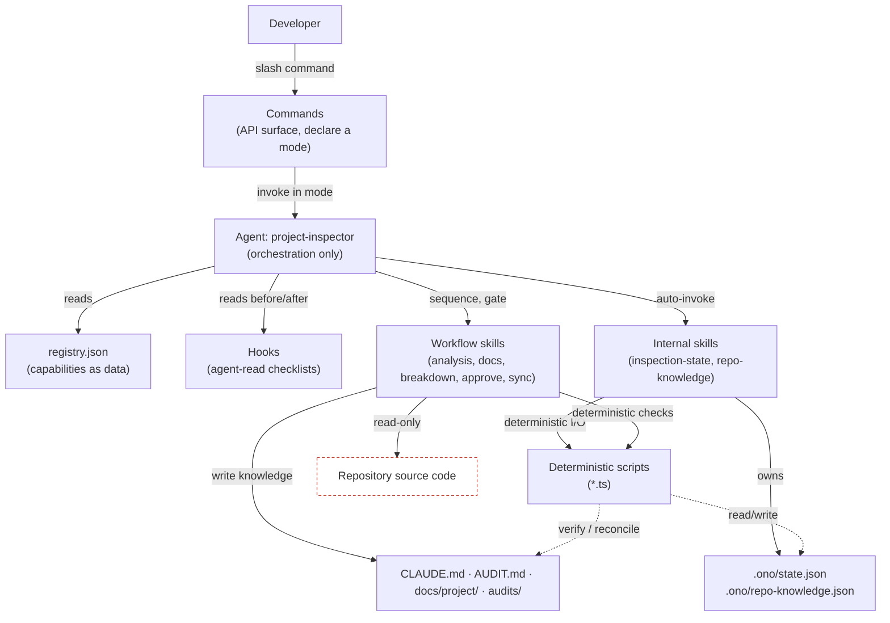
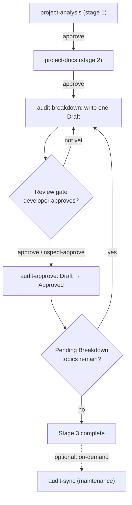

# Project Inspector — Plugin Architecture

**Status:** living document · **Scope:** how this plugin is built and why.
**Plugin repository:** [`OnOAppsDev/ono-plugin-project-inspector`](https://github.com/OnOAppsDev/ono-plugin-project-inspector)
**Entry point:** for the ecosystem overview, how the plugins cooperate, and the end-to-end workflow, start at [`docs/architecture/ecosystem-overview.html`](../../architecture/ecosystem-overview.html). This document assumes you have read it and answers the next question: *how is the Inspector itself put together?*
**Companion:** [`inspection-workflow.md`](inspection-workflow.md) — what to type, in what order.

> All file paths below (`skills/`, `agents/`, `scripts/`, `commands/`, `hooks/`) are relative to the **plugin repository**, not to this documentation repository.

> **Reading note.** Everything described here is implemented and traceable to a file in this repository. Nothing is aspirational; where a capability does not exist, it is not described.

---

## 1. Core architecture

A strict, layered pipeline. Control flows downward; each layer has one kind of responsibility and never reaches around its neighbours.

```
Developer
   ↓        types a slash command
Commands    thin API surface (mode declarations)
   ↓        invoke the one agent in a declared mode
Agent       orchestration only — reads the registry, sequences skills, enforces gates
   ↓        auto-invokes infrastructure
Internal skills   persistent state, knowledge manifest (via deterministic scripts)
   ↓        sequences domain work
Workflow skills   business logic — the only writers of repository artifacts
   ↓        read source (read-only), write knowledge artifacts
Repository  source code (never modified) + generated knowledge + .ono/ state
```



The single most important structural rule: **the agent orchestrates but never writes; skills write but never orchestrate.** Everything else follows from that split.

---

## 2. Why a registry instead of hardcoded orchestration

If `agents/project-inspector.md` contained explicit steps like "run project-analysis, then run audit-breakdown," adding a new skill would require editing that file — and every other skill's ordering assumptions would need re-checking. Instead the agent's logic is generic:

```
read registry -> consider only workflowRole: inspection entries -> sort by stage ->
  for each entry:
    check requires[] exist -> run before-hook (if any) ->
    invoke skill by id -> run after-hook (if any) ->
    stop if requiresApproval
  paired entries (role + pairsWith, e.g. audit-breakdown <-> audit-approve)
    iterate as one loop: break down -> review gate -> approve -> continue
```

Adding a skill that fits an existing shape — a linear stage, a loop partner, or a maintenance tool — is a data change: one JSON entry, one skill folder, optionally one hook file and one command. Introducing a genuinely new orchestration shape is the rare case that also updates the agent.

---

## 3. Components

Each maps to real files.

### Commands
**Files:** `commands/*.md`

Commands are the **public API** and nothing more: a thin wrapper declaring an agent **mode** and passing arguments through. No orchestration logic, no repository analysis.

| Command | Mode | Purpose |
|---|---|---|
| `/inspect [repo]` | `full` | Run the guided end-to-end workflow. State-aware: detects prior progress and offers choices. |
| `/inspect-status [repo]` | `status` | Read-only progress snapshot; writes nothing. |
| `/inspect-topic [topic] [repo]` | `targeted` | Run one breakdown cycle for a specific or next topic. |
| `/inspect-approve [repo]` | `resume` | Approve the current gate — finalize a Draft, or advance a stage. |
| `/inspect-sync [repo]` | `maintenance` | Run the on-demand maintenance tool and refresh the knowledge manifest. |

### Agent
**File:** `agents/project-inspector.md` (`tools: Read, Skill`)

The **sole orchestrator**. Reads the registry, sequences skills in stage order, consults hook checklists, enforces approval gates, uses the resume pointer, reports progress. Five modes, each entered by a command.

Hard boundaries, enforced in its own instructions:

- Never reads or writes `CLAUDE.md`, `AUDIT.md`, `audits/*`, or source — that is delegated to skills.
- Never hardcodes skill names, counts, or order beyond what the registry declares.
- Never advances past an approval gate without explicit developer confirmation.
- Holds only `Read` and `Skill`, so it structurally *cannot* edit files.

### Registry
**File:** `skills/registry.json`

The **capability contract**: a data description of every skill, how skills relate, and how they wire to hooks.

| Field | Meaning |
|---|---|
| `id`, `enabled`, `path` | Identity, on/off, location. |
| `type` | `workflow` (agent-sequenced) or `internal` (auto-invoked infrastructure). |
| `autoInvoke` | For `internal` skills: the agent calls them automatically at checkpoints. |
| `stage` | Ordering within the linear inspection sequence. |
| `role`, `pairsWith` | Intra-stage relationships, e.g. the breakdown ↔ approve pair. |
| `workflowRole` | `inspection` (in the linear loop) or `maintenance` (on-demand only). |
| `requires`, `produces` | Prerequisite and output artifacts. |
| `completion` | How completion is detected: `artifacts` (all `produces` exist — the default) or `topics` (every `AUDIT.md` topic Approved). |
| `repeatable`, `requiresApproval` | Loop semantics and gating. |
| `hooks` | `{ before, after }` checkpoint files. |

### Internal skills
**Files:** `skills/inspection-state/SKILL.md`, `skills/repo-knowledge/SKILL.md` (both `type: internal`, `autoInvoke: true`)

Internal skills own **infrastructure**, not domain output. They are not user-facing, have no command, never appear as a workflow stage, have no approval gate, and are invoked automatically at defined checkpoints.

- `inspection-state` owns `.ono/state.json` — see §5.
- `repo-knowledge` owns `.ono/repo-knowledge.json` — see §6.

### Workflow skills
**Files:** `skills/{project-analysis,project-docs,audit-breakdown,audit-approve,audit-sync}/SKILL.md`

Workflow skills own **all business logic** and are the **only components permitted to write repository artifacts**, each within its own output contract. They ask their own intake questions and do read-only source inspection.

| Skill | Stage / role | Writes | Never |
|---|---|---|---|
| `project-analysis` | 1 · analysis | `CLAUDE.md`, `AUDIT.md` | no `audits/` |
| `project-docs` | 2 · docs | `docs/project/*.md` | no `CLAUDE.md` / `AUDIT.md` |
| `audit-breakdown` | 3 · breakdown | one `audits/<slug>/<slug>-audit.md` (Draft) | never marks Approved |
| `audit-approve` | 3 · approval | flips one `AUDIT.md` row → Approved | never drafts, never touches `CLAUDE.md` |
| `audit-sync` | maintenance | `CLAUDE.md` managed blocks only | never marks Approved; `AUDIT.md` read-only |

### Hooks
**Files:** `hooks/*.md`

Hooks are **agent-read markdown checklists**, consulted before and after a stage. **They are deliberately not Claude Code `hooks.json` / `PreToolUse` events.** That keeps the extensibility model uniform — everything the agent consults is text it reads and follows — and avoids shell-level plumbing for what is fundamentally an LLM-driven review-and-approve flow. A hook is the enforcement point where the agent verifies a skill's output contract, often by running a deterministic script, and decides whether to proceed, loop, or stop.

If a future skill needs a hard, code-enforced gate — actually blocking a write — that would be a separate, explicit addition, not assumed here.

### Deterministic scripts
**Files:** `scripts/*.ts`

Skills produce prose by LLM judgment, which is unreliable for exact-match bookkeeping. Deterministic scripts own that structured data:

| Script | Owns |
|---|---|
| `slugify.ts` | The single source of truth for topic → slug. |
| `update-audit-index.ts` | Verifies an `AUDIT.md` row (status, and that the `File` reference matches the deterministic slug). **Verification-only** — never rewrites; discrepancies are reported, not patched. |
| `inspection-state.ts` | Reads, writes, reconciles and migrates `.ono/state.json`. |
| `repo-knowledge.ts` | Emits and validates `.ono/repo-knowledge.json`. |
| `resolve-repo-root.ts` | Resolves one authoritative `TARGET_ROOT`, unwrapping agent worktrees. |
| `verify-artifacts.ts` | Independently confirms a stage's artifacts exist at the real root. |

Scripts never make judgment calls and never write prose artifacts.

### Generated knowledge
All in the **target** repository:

- `CLAUDE.md` — compact project context for every future session; contains `audit-sync` managed-block markers.
- `AUDIT.md` — concise audit **topic index**; the **human source of truth** for topic status.
- `docs/project/*.md` — descriptive knowledge base: overview, components, patterns, integrations.
- `audits/<slug>/<slug>-audit.md` — one evaluative audit document per topic.
- `.ono/state.json` and `.ono/repo-knowledge.json` — see §5 and §6.

**Source code is never modified** by any component.

---

## 4. Workflow engine

The engine is the agent's generic loop over the registry — there is no separate runtime.

**Stage execution.** The agent considers only enabled entries with `type: workflow` and `workflowRole: inspection`, in ascending `stage` order. For each: **prerequisite check → before-hook → invoke skill → after-hook → update state → approval gate.**

**The breakdown-approve loop.** Stage 3 is not linear; it is a loop expressed via `role`/`pairsWith`. `audit-breakdown` (`requiresApproval: true`) writes one Draft and stops at a review gate. On approval, `audit-approve` (`requiresApproval: false` — running it *is* the approval) finalizes that topic, and the agent immediately breaks down the next one. Two Drafts are never generated without a review gate between them.



**Approval model.** Skills each enforce their own "ask, confirm, wait" steps internally. The registry's `requiresApproval` is a second, orchestration-level gate: even if a skill technically could continue, the agent will not chain into the next stage without the developer saying so. Splitting finalization into its own `audit-approve` skill is what makes the model explicit — breakdown drafts, approve finalizes, and `audit-sync` only ever reflects already-Approved topics.

**Resume.** On startup the agent does not re-guess progress from files; it reads the resume pointer from `inspection-state` and continues exactly there.

---

## 5. Inspection state

`.ono/state.json`, owned exclusively by `inspection-state` via `scripts/inspection-state.ts`.

**Why it exists.** Before it, resume was reconstructed by guessing from artifacts on disk, with no record of what was done, in which version, or where an interrupted run stopped. The state file gives the workflow durable, portable, versioned memory: detect a prior inspection, resume precisely, detect a version mismatch, and migrate forward.

**Shape (schema v1).** Plugin and schema versions; git remote and head; per-stage completion; a reconciled snapshot of the `AUDIT.md` topic table with counts and timestamps; a `resume` pointer; maintenance timestamp; migration history.

**Two rules keep it safe:**

- **`AUDIT.md` remains the human source of truth.** It is what a person reads and reasons about. State must never override it — on every `sync`, the topic snapshot is re-derived *from* `AUDIT.md`.
- **The file is portable.** Only repo-relative paths and the git remote are stored, never absolute filesystem paths, so it is committed to Git and travels across machines and clones.

For *orchestration decisions* — resume, completion, version and migration — `state.json` is authoritative, because the agent needs exact machine-readable answers that prose cannot reliably give. The two never conflict, because state is a projection of `AUDIT.md` plus orchestration-only fields.

**Fully registry-driven.** The helper contains no hardcoded stage list. It reads the ordered `workflow` + `inspection` entries from `registry.json` and derives per-stage completion, `completedStages`, `currentStage` and the resume pointer from each stage's `stage`, `produces` and `completion`. Adding a linear stage is a registry entry plus a skill folder — the agent executes it and the helper tracks and resumes it with no code change.

**Versioning and migrations.** State records the writing plugin version and an independent `stateSchemaVersion`. A mismatch is surfaced to the developer before proceeding, and `migrate` advances an older file to the current schema, recording each step.

---

## 6. The outbound repository-knowledge contract

This plugin's knowledge is consumed by other Ono plugins, not only by future Claude Code sessions.

Before `.ono/repo-knowledge.json` existed, every downstream plugin re-derived repository knowledge from source, then snapshotted the result into per-feature documents that went stale silently. The same facts were derived several times in different vocabularies with no reconciliation.

`skills/repo-knowledge` closes that gap by publishing one deterministic, versioned index over what this workflow has already produced and the developer has already approved. Three rules keep it safe:

- **Derived, never authored.** It reads only `CLAUDE.md`, `AUDIT.md`, and `docs/project/*.md`. It never reads source and never reads an audit file's body, so it adds no analysis and no approval gate — the human review that gated those artifacts is the same review that gates the manifest.
- **Pointers, not copies.** Prose stays in the artifact; the manifest carries paths and heading anchors. The artifacts remain the source of truth, so no fact has a second place to drift.
- **Honest coverage.** Every category reports `populated`, `partial` or `unknown`, and consumers are contractually required to derive `unknown` categories themselves. That is what makes a repository inspected by an older plugin version — and one never inspected at all — keep working unchanged.

The structured half of the manifest comes from a `<!-- repo-knowledge:facts:start/end -->` block in `CLAUDE.md`, using the same managed-block idea as `audit-sync` but in the opposite direction: the skill writes prose plus a machine-readable mirror, and the deterministic helper reads the mirror. When the block is absent — every `CLAUDE.md` written before this existed — the helper falls back to the template's fixed Tech Stack bullets and Commands block.

The manifest refreshes after `project-analysis`, after `project-docs`, after each `audit-approve`, and after `audit-sync`. Startup detection stays read-only, so a curious `/inspect` still writes nothing.

**See the plugin repository's `docs/repo-knowledge-contract.md`** for the schema and the obligations a consumer accepts. It deliberately ships inside the plugin, alongside the code that implements it, and is vendored byte-identically into every consuming plugin — Claude Code has no cross-plugin dependency mechanism, so that is the only way both ends can ship the same pinned specification.

---

## 7. Target-root resolution and artifact verification

Artifacts must land in the developer's real repository, never in an ephemeral execution copy.

Claude Code may run an agent inside an isolated git worktree at `<repo>/.claude/worktrees/agent-<id>/`. Inside it, both the working directory and `git rev-parse --show-toplevel` resolve to the worktree — itself a legitimate git root — so any CWD-relative write silently strands artifacts there while completion checks against the same wrong root report success.

Two deterministic helpers close that gap:

- `resolve-repo-root.ts` resolves a single authoritative `TARGET_ROOT` at startup, unwrapping a Claude agent worktree to the main working tree via `git worktree list --porcelain`. It unwraps **only** `.claude/worktrees/` paths — a worktree the developer deliberately targeted is honored. If one cannot be safely unwrapped, it exits non-zero and the workflow stops rather than writing.
- `verify-artifacts.ts` is the backstop each after-hook runs: it independently confirms a stage's artifacts exist at `TARGET_ROOT`, never trusting a skill's textual "written" report, fails if `TARGET_ROOT` is itself a worktree, and scans for artifacts that leaked into a worktree.

`TARGET_ROOT` is threaded as an absolute path into every skill invocation and every script call, and `inspection-state.ts` and `repo-knowledge.ts` both refuse to operate on a `.claude/worktrees/` path. A stage is reported complete only after its verification passes. These are defence-in-depth layers: resolve-before-write fixes the cause, and independent verification makes a false "complete" structurally impossible.

---

## 8. Design principles

1. **Single responsibility.** Every component does one thing. `audit-breakdown` drafts; `audit-approve` finalizes; `audit-sync` maintains docs.
2. **Commands are API only.** They declare a mode and pass arguments. The surface stays stable as internals change.
3. **The agent owns orchestration.** All sequencing, gating and resume in one agent, which holds only `Read`/`Skill` and cannot write.
4. **Skills own business logic.** Domain reasoning and *all* repository writes, each within a declared output contract.
5. **Internal skills own infrastructure.** Cross-cutting plumbing is auto-invoked and never a user-facing stage.
6. **Deterministic scripts own structured data.** Slugs, table bookkeeping, JSON state. Scripts verify; they do not silently patch.
7. **Documentation is human-readable.** The generated knowledge is for people first; machine state lives separately in `.ono/`.
8. **Everything is resumable.** Any run can be interrupted and continued precisely, driven by the resume pointer.
9. **Versioning and migrations are first-class.** Recorded from v1, with mismatches surfaced.
10. **Honest coverage over completeness.** A value that cannot be determined is reported unknown, never guessed.

Two cross-cutting invariants underpin all ten: **read-only toward source code**, and **human approval before anything consequential**.

---

## 9. Extending the plugin

To add a new skill, e.g. `security-inspector`:

1. Place it under `skills/security-inspector/` and list it in `plugin.json`'s `skills[]`.
2. Add one entry to `skills/registry.json` with its `type`, `stage`, `role`/`pairsWith`/`workflowRole`, `requires`, `produces`, `completion`, and `requiresApproval`. For a linear stage, `produces` + `completion` are all the state helper needs — no script change.
3. Optionally add `hooks/after-security-inspector.md` and a command.

If it fits an existing orchestration shape — a linear stage, a loop partner, or an on-demand maintenance tool — no change to the agent or existing hooks is needed. Only a genuinely new pattern, as the breakdown-approve loop itself once was, requires updating the agent.

---

## 10. Traceability

| Concept | Where it lives |
|---|---|
| Commands / modes | `commands/*.md` |
| Agent / orchestration | `agents/project-inspector.md` |
| Registry contract | `skills/registry.json` |
| Internal skills | `skills/{inspection-state,repo-knowledge}/SKILL.md` |
| Workflow skills | `skills/{project-analysis,project-docs,audit-breakdown,audit-approve,audit-sync}/SKILL.md` |
| Hooks (agent-read) | `hooks/*.md` |
| Deterministic scripts | `scripts/*.ts` |
| Knowledge artifacts | target repo: `CLAUDE.md`, `AUDIT.md`, `docs/project/`, `audits/` |
| Machine state | target repo: `.ono/state.json`, `.ono/repo-knowledge.json` |
| Outbound contract | plugin repo: `docs/repo-knowledge-contract.md` |
| Distribution | `ono-plugin-marketplace/.claude-plugin/marketplace.json` |
