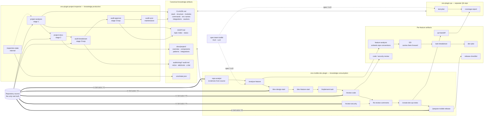
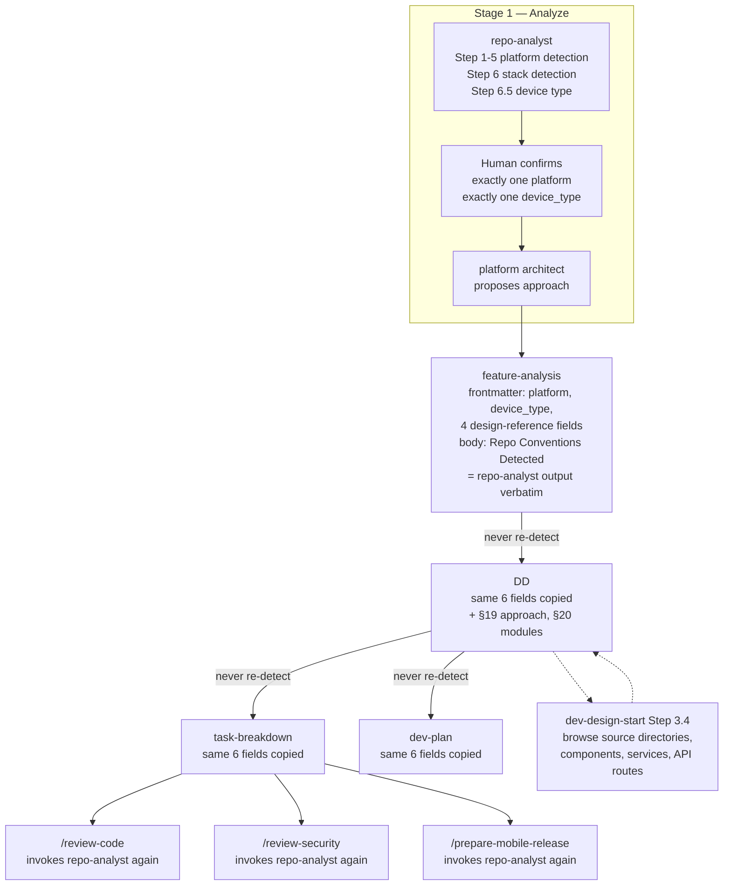
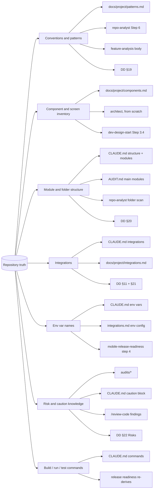
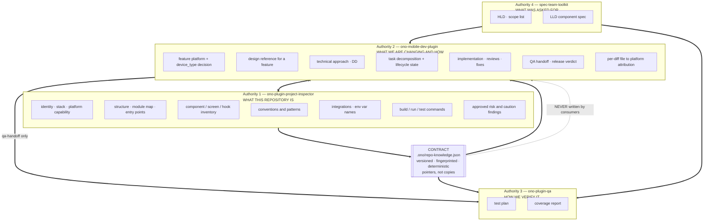
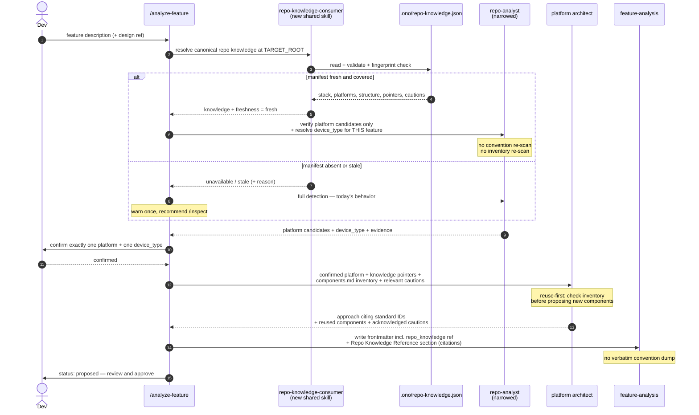
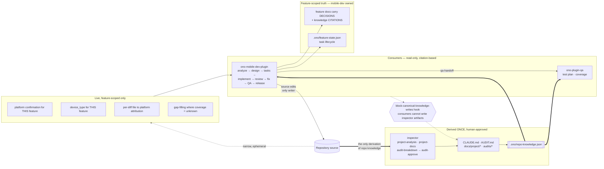
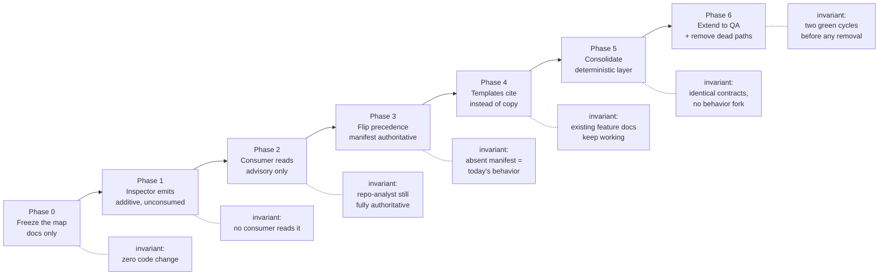

# Ono Plugin Ecosystem — Repository Knowledge Encapsulation

**Architectural review and proposal · 2026-07-28**
Scope: `ono-plugin-project-inspector` (v0.8.0) · `ono-mobile-dev-plugin` (v0.3.0) · with `ono-plugin-qa` (v0.3.0) and `spec-team-toolkit` (v0.1.0) as participating downstream plugins.

> This document is a proposal. Nothing had been implemented when it was written, and no plugin file was modified while producing it. It is retained as the record of *why* the architecture is what it is.

> **Note on paths.** Document paths cited below reflect the layout at review time, before the documentation was consolidated. Several have moved or been merged: the inspector's platform-overview and platform-architecture documents are now `ono-plugin-project-inspector/docs/architecture/plugin-architecture.md`, and its workflow document is now `docs/workflows/inspection-workflow.md`. Start at `docs/architecture/ecosystem-overview.html` for the current layout.

---

## 1. Method and scope

Every file in both primary plugins was read in full — 34 files / ~4,000 lines in the inspector, 100 files / ~5,100 lines in the mobile-dev plugin — plus the QA plugin, the marketplace manifest, and the spec toolkit to establish whether they participate in the same information flow.

Three cross-plugin searches were run to establish the actual coupling, not the intended coupling:

| Search | Result |
|---|---|
| Inspector artifacts (`CLAUDE.md`, `AUDIT.md`, `docs/project/`, `.ono/`, `project-analysis`, …) referenced anywhere in `ono-mobile-dev-plugin` | **1 hit**, and it is a comment: `scripts/resolve-target-repo-root.ts:18` |
| Same search against `ono-plugin-qa` | **0 hits** |
| Mobile-dev artifacts or `repo-analyst` referenced in `ono-plugin-qa` | **0 hits** |

That single hit is the finding in miniature:

> *"This is ono-mobile-dev-plugin's own self-contained copy. Its algorithm and JSON/exit-code contract intentionally mirror the proven `resolve-repo-root.ts` design from the sibling ono-project-inspector plugin; it is duplicated here (not imported) so this plugin has no cross-plugin runtime dependency."*
> — `ono-mobile-dev-plugin/scripts/resolve-target-repo-root.ts:18-22`

The two plugins are aware of each other at design time and completely decoupled at runtime. Nothing is broken. But the ecosystem derives the same repository knowledge two to five times, in two different vocabularies, with no reconciliation and no way to detect divergence.

**The architectural issue is confirmed, and it is a missing contract, not a defect in either plugin.**

---

## 2. Executive summary

The inspector is a knowledge *production* platform: it derives repository truth once, gates it behind human approval, and persists it as `CLAUDE.md`, `AUDIT.md`, `docs/project/*`, `audits/*`, and `.ono/state.json`. Its own documentation states the ambition explicitly — *"the valuable output is the platform itself"* (`docs/PLATFORM_OVERVIEW.md`) — and names the dev plugin as an expected consumer.

The mobile-dev plugin is a knowledge *consumption* pipeline — eight gated stages, each reading the previous stage's approved artifact. It is well-built and internally consistent. But its first stage begins by re-deriving repository knowledge from source, via `repo-analyst`, on every command that needs it, and then **snapshots that derivation into per-feature documents that live forever**.

The two halves never meet. The consequence is not just wasted context:

1. **`docs/project/components.md` is written for exactly the job `/analyze-feature` does** — *"Before writing a spec or design doc for a new feature, check here whether a screen, component, or flow already exists that the feature should reuse"* (`project-docs/SKILL.md:272`) — and no mobile-dev component reads it. The architects propose new screens and components without the existing inventory in hand.
2. **Approved audit findings never reach the reviewers.** A `HIGH` finding in `audits/networking/networking-audit.md`, human-approved and synced into `CLAUDE.md`, is invisible to `/review-code`. It gets re-discovered, re-worded, or silently contradicted.
3. **Repository facts are frozen into feature documents.** Every feature analysis carries a verbatim `Repo Conventions Detected` section. After the next refactor, that section is wrong — but it is now upstream of an approved DD, a task breakdown, and a dev plan, all of which instruct downstream stages to *"never re-detect"*.

The proposal: **one authority per knowledge category, one canonical machine-readable contract between the plugins, and citation instead of copying.**

- The inspector becomes the sole authority on **"what this repository is."**
- The mobile-dev plugin becomes the sole authority on **"what we are changing and how."**
- They are joined by a versioned, deterministic, fingerprinted manifest — `.ono/repo-knowledge.json` — that the inspector emits and downstream plugins read.
- Dependency runs in exactly one direction, is enforced by a hook rather than by prose, and every consumer degrades gracefully to today's behavior when the manifest is absent.

Everything below is additive first. No stage stops working at any point in the migration.

---

## 3. The current end-to-end information flow

### 3.1 Full picture



The `x--x` edges are the architectural gap: **no information crosses from the canonical artifacts into either consumer plugin.**

### 3.2 Inspector: how knowledge is produced

Fully registry-driven. `skills/registry.json` is the single declaration of stages, order, prerequisites, produced artifacts, and completion semantics; `agents/project-inspector.md` reads it and sequences generically; `scripts/inspection-state.ts` derives completion and resume from the same file. Five commands, five invocation modes, human approval at every consequential step.

| Stage | Skill | Produces | Completion rule |
|---|---|---|---|
| 0 | `inspection-state` *(internal, auto)* | `.ono/state.json` | — |
| 1 | `project-analysis` | `CLAUDE.md`, `AUDIT.md` | `artifacts` |
| 2 | `project-docs` | `docs/project/{overview,components,patterns,integrations}.md` | `artifacts` |
| 3 | `audit-breakdown` ↔ `audit-approve` | `audits/<slug>/<slug>-audit.md`, `AUDIT.md` status | `topics` |
| — | `audit-sync` *(maintenance)* | `CLAUDE.md` managed blocks only | — |

Notable strengths worth preserving verbatim in the new design:

- **Single-writer discipline is already exemplary.** `audit-approve` is the sole owner of `Draft → Approved`. `audit-sync` writes only between two markers in `CLAUDE.md` and treats `AUDIT.md` as read-only. `inspection-state` writes exactly one file. Every skill's Output Contract enumerates what it may and may not touch.
- **Deterministic bookkeeping is separated from LLM prose.** `slugify.ts`, `update-audit-index.ts`, `verify-artifacts.ts`, `inspection-state.ts` — structured facts never depend on model judgment.
- **`AUDIT.md` is the human source of truth; `.ono/state.json` mirrors it and never overrides it.** That precedence rule is exactly the one the new contract needs.
- **`.ono/` is already declared a shared namespace**: *"The `.ono/` directory is the shared Ono infrastructure directory; this plugin owns only `state.json` within it"* (`inspection-state/SKILL.md:43`). The seam for a knowledge manifest already exists and is already documented.

### 3.3 Mobile-dev: how knowledge is consumed and re-derived



The copy-forward chain is deliberate and, for **decisions**, correct: a human-confirmed platform must not be silently re-detected three stages later. The problem is that the same mechanism carries **observations** — repo conventions — which *do* go stale, and carries them with the same "never re-detect" instruction that protects the decisions.

### 3.4 Cross-plugin flow today

| Boundary | Mechanism | Status |
|---|---|---|
| inspector → mobile-dev | none | **missing** |
| inspector → QA | none | **missing** |
| mobile-dev → QA | `qa-handoff-template.md`, read from the code repo by `/check-qa-coverage` | works, file-mediated, one-directional |
| spec toolkit → mobile-dev / QA | human passes an LLD path as a command argument | works, informal |
| QA → anything | nothing written back | by design |

The mobile-dev → QA edge is the model to generalize: **a file in a known location, read-only for the consumer, with the producer named.** It is exactly what the inspector → downstream edge is missing.

---

## 4. Where repository knowledge is duplicated or re-derived

Fourteen findings, ordered by cost. Each is evidenced by file references, not inference.



### D1 — Conventions and patterns: derived up to 4×

`docs/project/patterns.md` and `repo-analyst` Step 6 answer the same questions with different vocabularies and no reconciliation.

| `patterns.md` section (`project-docs/SKILL.md:311-357`) | `repo-analyst` Step 6 (`agents/repo-analyst.md:67-72`) |
|---|---|
| State Management | state-management library |
| Data Fetching / API Conventions | data-fetching layer |
| Navigation Patterns | navigation library |
| Styling Conventions | — |
| Error Handling Patterns | — |
| Localization / RTL | — |
| Naming and Folder Conventions | folder structure vs `ARCH-LAYERS-*` / `ARCH-FOLDERS-*` |
| Testing Patterns | test runner |
| Patterns to Avoid | — |

The inspector's version is broader and human-approved. The mobile-dev version is narrower, standards-aware, and never reconciled against it. Then it is copied a third time into every feature analysis and a fourth time into each DD §19.

**Cost:** the richer approved artifact is unused; the narrower live one is re-derived per command.

### D2 — Component and screen inventory: derived 3×, and the highest-value loss

`components.md` inventories screens, reusable components, shared hooks, the navigation map, the design system, **and known duplicates/deprecated components**, with paths. Its stated audience is spec writers checking what exists *before speccing a feature*.

`rn-architect` (`agents/rn-architect.md:20-21`) takes as input only *"`repo-analyst`'s structured findings summary"* plus two standards files. Its process proposes *"any new screens, RTK slices/endpoints, and navigation routes"* — with no reuse check against an existing inventory. `dev-design-start` Step 3.4 then partially re-derives the same thing by browsing source.

**Cost:** the plugin most likely to create a duplicate component is the one component in the ecosystem that cannot see the duplicate-component list.

### D3 — Module and folder structure: derived 4×

`CLAUDE.md` *Repository Structure* + *Key Modules*; `AUDIT.md` *Main Modules and Responsibilities*; `repo-analyst`'s folder-structure scan; DD §20 *Impacted Modules*. Note that two of the four are **inside the inspector** — the module map is stated twice in two of its own artifacts.

### D4 — Integrations: derived 3×, twice inside the inspector

`CLAUDE.md` *External Integrations* (`project-analysis/SKILL.md:274-276`) and `docs/project/integrations.md` (backend services, SDKs, auth, analytics, push, payments) cover the same ground at different depths, with no pointer between them. `/review-security` and DD §11/§21 then re-derive service dependencies a third time.

### D5 — Environment variable names: derived 3×

`CLAUDE.md` *Environment variables detected from sample/template files only*; `integrations.md` *Environment Configuration*; `mobile-release-readiness` step 4 *"Confirm env vars per environment"*. Three independent derivations of the same list, each with its own "names only, never values" rule restated.

### D6 — Risk and caution knowledge: approved findings never reach the reviewers

This is the correctness risk, not just a duplication cost.

`audit-sync` folds `HIGH`/`MEDIUM` findings from **approved** audits into `CLAUDE.md`'s caution block so that *"every future Claude Code session in this repo now sees these findings"* (`audit-sync/SKILL.md:153`). But `/review-code` (`commands/review-code.md`) loads only `standards/shared/*` and `standards/<platform>/*`. `rn-code-review/SKILL.md` triages files into `RN-*`/`API-*`/`STATE-*`/`I18N-*`/`A11Y-*`/`ARCH-*`/`NAV-*` buckets. Neither reads `audits/` or the caution block.

A human-approved `HIGH` finding — *"`SessionManager` holds mutable global state accessed from 14 files"* — is therefore invisible to the reviewer of a change to `SessionManager`. Meanwhile DD §22 *Risks* invites the architect to invent a risk list from scratch alongside an existing approved one.

### D7 — Build/run/test commands: derived 2×

`CLAUDE.md` records install/run/test/build commands. `mobile-release-readiness` and `/implement-task`'s validation step re-derive what to run.

### D8 — Platform knowledge: an inverse gap, and a distinction that must be preserved

The inspector records platform as **free prose** in `CLAUDE.md`'s Tech Stack (`- Platform(s): {{PLATFORMS}}`, `project-analysis/SKILL.md:228`). It has no structured platform field, no device-target concept, and no notion of RN-vs-native-shell linkage.

The mobile-dev plugin has a rigorous, 6-step, evidence-based detection algorithm for exactly that (`agents/repo-analyst.md:25-81`), including the RN-shell linkage check and monorepo workspace scoping.

**These are two different facts and must stay two different facts:**

| Fact | Meaning | Correct owner |
|---|---|---|
| **Repo platform capability** | "this repo contains an RN app whose iOS shell is linked, plus an independent Android project" | **inspector** — a property of the repository |
| **Feature platform decision** | "this feature targets `ios` / `tv`" — human-confirmed, exactly one value | **mobile-dev** — a property of the work |

Collapsing them would be the single most damaging mistake available here. The proposal keeps them separate and names the second as explicitly *not* inspector-owned.

### D9 — Deterministic root resolution: self-admitted duplicate

`resolve-repo-root.ts` (inspector) and `resolve-target-repo-root.ts` (mobile-dev) implement the same algorithm and the same JSON/exit-code contract. The duplication is documented and was a reasonable call — Claude Code plugins have no cross-plugin import mechanism. But there is no shared contract document, no conformance test across the two, and no version marker, so they can drift silently.

Worse, the duplication is **partial**: the inspector's `verify-artifacts.ts` backstop — *"never trusting the skill's textual 'written' report"* — has **no equivalent in mobile-dev**, which writes far more consequential things (source code). The mobile-dev plugin adopted the resolver and not the verifier.

### D10 — Orchestration state: one plugin has it, the other needs it

The inspector has `.ono/state.json` with versioning, schema migrations, per-stage completion, and a resume pointer, all derived generically from `registry.json`.

The mobile-dev plugin's own audit names the absence of the same thing as a top-5 blocker:

> *"**Known follow-up gap (do not build in this change):** the plugin has no deterministic per-task lifecycle/status store, so 'task complete' and dependency completeness are not machine-verifiable end-to-end yet."*
> — `commands/implement-task.md:213`, and `SHARED-004` in `PLUGIN_COMPLETION_PLAN.md`

A solved pattern sits one directory away, in a namespace already declared shared, and is being planned from scratch.

### D11 — Orchestration model: registry-driven vs prose-hardcoded

The inspector's workflow is data (`registry.json`); adding a stage is one JSON entry. The mobile-dev pipeline's eight stages, gates, and routing are hardcoded in prose across nine command files. `/implement-task` alone is 140 lines of orchestration logic. Stage order, prerequisites, and approval gates exist only as English sentences repeated per command.

This is not repository-knowledge duplication, but it is squarely inside the stated goal of minimizing duplicated context, and it is the reason the mobile-dev plugin cannot reuse the inspector's resume/state machinery.

### D12 — Frontmatter copy-by-value: 6 fields × 4 templates

`platform`, `device_type`, `design_reference_status`, `design_reference_type`, `design_reference`, `figma_link` are copied verbatim through `feature-analysis → dd → task-breakdown → dev-plan`, each template restating the "carried over, never re-detect" rule in comments. `/implement-task` §4 then verifies cross-document consistency by hand.

The values are correct to carry — they are decisions. But copy-by-value with prose-enforced invariants and a manual consistency check is fragile where a single referenced decision record would not be.

### D13 — Repo observations frozen into permanent feature documents

`feature-analysis-template.md`'s `## Repo Conventions Detected` embeds *"repo-analyst's structured findings, verbatim."* That section is a point-in-time observation of a moving repository, stored permanently in an approved document that three downstream stages are instructed to trust and not re-derive.

Six months and one navigation-library migration later, an approved feature analysis asserts conventions that no longer exist — with full downstream authority.

### D14 — QA and spec plugins are outside the knowledge system entirely

`ono-plugin-qa` designs test plans from Figma and spec/LLD only. It has no access to the component inventory (what else touches this screen), the integrations list (what can fail), or approved audit findings (where the bugs historically are) — all of which are exactly what risk-based test design wants. `spec-team-toolkit` produces the HLD/LLD that feed `/analyze-feature` and `/create-qa-test-plan`, connected only by a human pasting a path.

---

## 5. Ownership boundaries

### 5.1 The two authorities



**The rule, stated once:** knowledge about the *repository* flows down from the inspector. Knowledge about the *work* flows forward through the mobile-dev pipeline. Nothing flows back up. The inspector never reads a feature document; no consumer ever writes a canonical artifact.

### 5.2 Artifact ownership registry — every artifact in the ecosystem

| Artifact | Sole writer | Category | Consumers | Notes |
|---|---|---|---|---|
| `CLAUDE.md` body | `project-analysis` | repo knowledge | all plugins, all sessions | |
| `CLAUDE.md` managed blocks | `audit-sync` | repo knowledge | all | marker-delimited; already single-writer |
| `AUDIT.md` topic table | `project-analysis` (create) → `audit-breakdown` (row) → `audit-approve` (status) | repo knowledge | inspector, consumers read-only | human source of truth for status |
| `docs/project/overview.md` | `project-docs` | repo knowledge | product, QA, spec toolkit | |
| `docs/project/components.md` | `project-docs` | repo knowledge | **architects (new)**, QA, spec | reuse-first input |
| `docs/project/patterns.md` | `project-docs` | repo knowledge | **architects, reviewers (new)** | supersedes `repo-analyst` Step 6 |
| `docs/project/integrations.md` | `project-docs` | repo knowledge | **security review, release (new)** | |
| `audits/<slug>/<slug>-audit.md` | `audit-breakdown` | repo knowledge (evaluative) | **reviewers, architects (new)** | approved only |
| `.ono/state.json` | `inspection-state` | inspector orchestration | inspector | |
| **`.ono/repo-knowledge.json`** | **`repo-knowledge` (new, internal)** | **the contract** | **all consumer plugins** | derived, never authored |
| `<feature>-analysis.md` | `/analyze-feature` | feature decision | `/dev-design-start` | |
| `<feature>-DD.md` | `/dev-design-start` | feature design | `/dev-feature-start`, `/implement-task` | |
| `<feature>-tasks.md` | `/dev-feature-start` | feature plan | `/implement-task` | |
| `<feature>-plan.md` | `/dev-feature-start` | feature plan | `/implement-task` | |
| **`.ono/feature-state.json`** | **`/implement-task` (new)** | **feature lifecycle** | mobile-dev | closes `SHARED-004` |
| `*-code-review.md` / `*-security-review.md` | `/review-code` / `/review-security` | review output | `/fix-review-comments` | |
| `qa-handoff.md` | `/create-dev-qa-notes` | handoff | QA plugin | existing cross-plugin edge |
| `release-checklist.md` | `/prepare-mobile-release` | release | humans | |
| source code | `/implement-task`, `/fix-review-comments` | code | — | inspector must never write |
| `<feature>/test-plan.md` | `/create-qa-test-plan` | QA (QA repo) | `/check-qa-coverage` | |
| `<feature>/coverage-report.md` | `/check-qa-coverage` | QA (QA repo) | humans | |
| HLD / `scope-list.md` / LLD | spec toolkit | requirements | mobile-dev, QA | |

### 5.3 Knowledge-category ownership — the encapsulation rule

| # | Category | Owner | Derived by | Consumers read via | Consumers may re-derive? |
|---|---|---|---|---|---|
| 1 | Repo identity, stack, package managers | inspector | `project-analysis` | manifest `stack` | no |
| 2 | **Repo platform capability** (incl. RN-shell linkage, monorepo workspaces, device targets) | inspector | `project-analysis` *(extended)* | manifest `platforms` | only to verify against a changed fingerprint |
| 3 | Build / run / test / install commands | inspector | `project-analysis` | manifest `commands` | no |
| 4 | Structure, module map, entry points | inspector | `project-analysis` | manifest `structure` + `CLAUDE.md` | no |
| 5 | Component / screen / hook inventory | inspector | `project-docs` | pointer → `components.md` | no |
| 6 | Conventions and patterns | inspector | `project-docs` | pointer → `patterns.md` | only categories marked `unknown` |
| 7 | Integrations, SDKs, env var **names** | inspector | `project-docs` | pointer → `integrations.md` | no |
| 8 | Approved risk / caution findings | inspector | `audit-breakdown` + `audit-approve` | manifest `cautions` + `audits/` | no — must cite |
| 9 | **Feature platform + `device_type` decision** | **mobile-dev** | `/analyze-feature` + human | feature frontmatter | n/a — a decision, not an observation |
| 10 | Design reference for a feature | mobile-dev | `/analyze-feature` | feature frontmatter | n/a |
| 11 | Technical approach / DD content | mobile-dev | `/dev-design-start` | DD | n/a |
| 12 | Task decomposition + lifecycle status | mobile-dev | `/dev-feature-start`, `/implement-task` | breakdown + `.ono/feature-state.json` | n/a |
| 13 | Per-diff file→platform attribution | mobile-dev | `repo-analyst` | ephemeral, never persisted | always live — correct as-is |
| 14 | Test plan / coverage | QA | QA skills | QA repo | n/a |
| 15 | Requirements / HLD / LLD | spec toolkit | spec skills | handed in by a human | n/a |
| 16 | Repo-root resolution + artifact verification | **shared deterministic layer** | vendored scripts | identical contract, version-pinned | must not fork behavior |

Rows 9–13 are the deliberate answer to *"exactly one authoritative owner"* — the encapsulation is **not** "the inspector owns everything." Feature-scoped decisions and diff-scoped attribution belong to the pipeline that makes them, and the inspector must be forbidden from reading them.

---

## 6. The contract between the plugins

### 6.1 Design constraints that shape it

1. **Claude Code has no cross-plugin runtime dependency mechanism.** Coupling must be artifact-mediated. This is a platform constraint, and the mobile-dev plugin already reasoned to the same conclusion when it vendored the resolver.
2. **A consumer must work with no inspector present.** Plenty of repos will never be inspected. The manifest is an optimization and a correctness improvement, never a prerequisite.
3. **Knowledge crossing the boundary must be human-approved.** Only `Approved` audits contribute cautions. Draft findings never leak into a review.
4. **Consumers must not parse prose to get structured facts.** The inspector's own principle — deterministic scripts for anything exact — applies to the contract itself.
5. **The manifest is derived, never authored.** It restates facts already in the approved artifacts. It introduces no new analysis, so it cannot introduce a new source of truth or a new approval gate.

### 6.2 `.ono/repo-knowledge.json` — the canonical manifest

Owned by a new internal inspector skill, `repo-knowledge`, emitted by a new deterministic helper `scripts/repo-knowledge.ts`. Pointers, not copies, wherever the payload is prose.

```jsonc
{
  "repoKnowledgeSchemaVersion": 1,
  "producedBy": { "plugin": "ono-project-inspector", "version": "0.9.0" },
  "generatedAt": "ISO-8601",

  // Freshness: reuses the git head inspection-state already records.
  "fingerprint": {
    "gitHead": "sha or null",
    "gitRemote": "url or null",
    "dirty": false,
    "sourcedFrom": { "claudeMd": "sha256", "auditMd": "sha256", "docsProject": "sha256" }
  },

  // Which categories are actually populated. Consumers derive only what is `unknown`.
  "coverage": {
    "stack": "populated",
    "platforms": "populated",
    "commands": "partial",
    "structure": "populated",
    "inventory": "populated",
    "conventions": "populated",
    "integrations": "populated",
    "cautions": "populated"
  },

  "stack": {
    "languages": ["TypeScript", "Kotlin"],
    "frameworks": ["React Native"],
    "packageManagers": ["yarn"],
    "runtimeTooling": ["Metro", "Gradle"]
  },

  // Repo CAPABILITY — never a per-feature decision. Mirrors repo-analyst's evidence model.
  "platforms": {
    "present": ["react-native", "android"],
    "reactNativeNativeShells": { "ios": "linked", "android": "linked" },
    "independentNativeProjects": [],
    "monorepo": { "tooling": "yarn-workspaces", "workspaces": [
      { "path": "apps/mobile", "platforms": ["react-native"] },
      { "path": "apps/web", "platforms": ["react"] }
    ]},
    "deviceTargets": ["mobile"],
    "evidence": ["package.json:react-native", "Podfile:use_react_native!"]
  },

  "commands": { "install": "yarn", "run": "yarn ios", "test": "yarn test", "build": "Unknown" },

  "structure": {
    "entryPoints": ["index.js", "src/App.tsx"],
    "keyModules": [{ "path": "src/features", "responsibility": "feature modules" }]
  },

  // Pointers with stable anchors — the artifact stays the source, the manifest indexes it.
  "inventory":    { "pointer": "docs/project/components.md",   "anchors": ["#screens", "#reusable-ui-components", "#shared-hooks-utilities", "#navigation-map", "#design-system-theming", "#known-duplicates-or-deprecated-components"] },
  "conventions":  { "pointer": "docs/project/patterns.md",     "anchors": ["#state-management", "#data-fetching-api-conventions", "#navigation-patterns", "#styling-conventions", "#error-handling-patterns", "#localization-rtl", "#naming-and-folder-conventions", "#testing-patterns", "#patterns-to-avoid-observed-anti-patterns"] },
  "integrations": { "pointer": "docs/project/integrations.md", "envVarNames": ["API_BASE_URL", "SENTRY_DSN"] },
  "overview":     { "pointer": "docs/project/overview.md" },

  // Approved audits only. Structured so a reviewer can filter by path without parsing prose.
  "cautions": [
    {
      "topic": "Managers and Singletons",
      "severity": "HIGH",
      "summary": "SessionManager holds mutable global state accessed from 14 files",
      "paths": ["src/session/SessionManager.ts"],
      "audit": "audits/managers-and-singletons/managers-and-singletons-audit.md",
      "approvedAt": "ISO-8601"
    }
  ],

  "pointers": {
    "claudeMd": "CLAUDE.md",
    "auditMd": "AUDIT.md",
    "auditsDir": "audits/",
    "docsProjectDir": "docs/project/"
  }
}
```

Design notes:

- **`coverage` is what makes graceful degradation precise.** A consumer does not guess whether conventions are known; it reads a field. `partial` means "use it, and derive the gaps."
- **`cautions` carries `paths`** so `/review-code` can intersect its diff with known findings deterministically — no prose parsing, no LLM triage.
- **`sourcedFrom` hashes** let a consumer detect that `patterns.md` changed without an inspection run (someone hand-edited it) and report drift.
- **`platforms` mirrors `repo-analyst`'s evidence model** — including the linkage check and workspace scoping — so the consumer's narrowed detection has a real prior to verify against rather than a bare string.

### 6.3 The consumption contract — rules every consumer must satisfy

| # | Rule |
|---|---|
| C1 | **Read-only.** A consumer must never write `CLAUDE.md`, `AUDIT.md`, `docs/project/**`, `audits/**`, `.ono/state.json`, or `.ono/repo-knowledge.json`. Enforced by hook, not prose (§7.3). |
| C2 | **Resolve through a single skill.** Exactly one component per consumer plugin knows the manifest format. No command parses it inline. |
| C3 | **Cite, do not copy.** Downstream documents record `{ pointer, anchor, fingerprint }`, never a verbatim body paste of repo knowledge. |
| C4 | **Degrade, never fail.** An absent, stale, or newer-schema manifest is never fatal. Behavior falls back to today's live derivation. |
| C5 | **Do not re-derive a covered, fresh category.** If `coverage.conventions == populated` and the fingerprint matches HEAD, `repo-analyst` must not re-scan conventions. |
| C6 | **Report drift, never repair it.** A consumer that detects staleness says so and recommends `/inspect` or `/inspect-sync`. It never regenerates a canonical artifact. |
| C7 | **Approved only.** Cautions come from `Approved` topics. A consumer must never read `Draft` audit content. |
| C8 | **Decisions beat observations.** Where the manifest and a feature document disagree about `platform`/`device_type`, the human-confirmed feature frontmatter wins — and the disagreement is surfaced, not silently resolved. |

### 6.4 Degradation matrix

| Manifest state | Consumer behavior | User-visible |
|---|---|---|
| absent | full live derivation — **exactly today's behavior** | one-line note: repo knowledge not available, `/inspect` would improve this |
| present, fingerprint `gitHead` == HEAD, clean | authoritative for covered categories; `repo-analyst` narrowed to the delta | "using approved repo knowledge @ `<sha>`" |
| present, HEAD moved, no covered artifact hash changed | authoritative, staleness noted | "repo knowledge is N commits behind" |
| present, a `sourcedFrom` hash changed | authoritative for unaffected categories; re-derive affected ones | "`patterns.md` changed outside an inspection — re-derived conventions" |
| present, `coverage.<cat> == unknown` | derive that category live | silent — expected path |
| present, `repoKnowledgeSchemaVersion` > consumer max supported | treat as absent | "manifest schema vN not supported by this plugin version" |
| present, malformed / unparseable | treat as absent | warn with the exact parse error |

### 6.5 `/analyze-feature` under the contract



### 6.6 Proposed steady-state information flow



---

## 7. What changes — commands, skills, agents, templates, scripts

### 7.1 `ono-plugin-project-inspector`

| Component | Change | Type |
|---|---|---|
| `skills/repo-knowledge/SKILL.md` | **new** — internal, `autoInvoke: true`. Emits and refreshes the manifest from already-approved artifacts. Derives nothing new. | add |
| `scripts/repo-knowledge.ts` | **new** — deterministic emitter/validator: `emit`, `validate`, `fingerprint`. Registry-driven like `inspection-state.ts`. | add |
| `skills/registry.json` | add the `repo-knowledge` entry (`type: internal`, `produces: [".ono/repo-knowledge.json"]`); optionally add an `exports` field so the outbound contract is declared in data | modify |
| `agents/project-inspector.md` | invoke `repo-knowledge` (`emit`) at the same checkpoints as `inspection-state` (`sync`) | modify |
| `skills/project-analysis/SKILL.md` | capture **structured platform capability** (present platforms, RN-shell linkage, monorepo workspaces, device targets) instead of only prose `Platform(s)`. Replace `CLAUDE.md`'s duplicated *External Integrations* body with a pointer to `integrations.md`, resolving D4. | modify |
| `skills/project-docs/SKILL.md` | emit **stable heading anchors** in `components.md` / `patterns.md` so consumers can cite sections; keep templates otherwise unchanged | modify |
| `skills/audit-sync/SKILL.md` | after regenerating the `CLAUDE.md` blocks, trigger a manifest refresh so `cautions` tracks approvals | modify |
| `hooks/after-project-analysis.md`, `after-project-docs.md`, `after-audit-approve.md`, `after-audit-sync.md` | add a manifest-refresh + `verify-artifacts` step for `.ono/repo-knowledge.json` | modify |
| `commands/inspect-sync.md` | document that maintenance also refreshes the manifest — **no new command** | modify |
| `docs/architecture.md`, `README.md` | document the outbound contract and the schema-version policy | modify |

Deliberately unchanged: the registry-driven agent loop, all approval gates, the `Draft → Approved` single-writer rule, `AUDIT.md` as human source of truth, the worktree-safety layer. Nothing about the inspection workflow's shape changes.

### 7.2 `ono-mobile-dev-plugin`

| Component | Change | Type |
|---|---|---|
| `skills/repo-knowledge-consumer/SKILL.md` | **new** — the single component that knows the contract: resolve, validate, fingerprint-check, apply the degradation matrix, emit a normalized knowledge bundle + freshness verdict | add |
| `scripts/read-repo-knowledge.ts` | **new** — deterministic read/validate/diff-fingerprint. No LLM parsing of the manifest. | add |
| `scripts/verify-artifacts.ts` | **new** — vendor the inspector's backstop. Closes D9's asymmetry: the plugin that writes source code currently has no artifact verification. | add |
| `scripts/resolve-target-repo-root.ts` | pin a `resolverContractVersion`; add a conformance test mirroring the inspector's | modify |
| `hooks/block-canonical-knowledge-writes.{json,sh}` | **new** — mechanically block writes to `CLAUDE.md`, `AUDIT.md`, `docs/project/**`, `audits/**`, `.ono/state.json`, `.ono/repo-knowledge.json`. Encapsulation enforced the way this plugin already enforces its other invariants. | add |
| `agents/repo-analyst.md` | **largest single edit.** Steps 1–5 become *verify-against-manifest* when fresh, full detection when not. Step 6 (stack/conventions) runs **only** for categories `coverage` marks `unknown`. Step 6.5 (`device_type`) stays live — it is a feature decision. File attribution stays live — it is diff-scoped. | modify |
| `skills/mobile-repo-analysis/SKILL.md` | rewritten as *consume-then-delta*: resolve canonical knowledge, confirm platform with the human, derive only the gap | modify |
| `commands/analyze-feature.md` | step 1 becomes "resolve repo knowledge"; add drift/absence handling; pass inventory + relevant cautions to the architect | modify |
| `commands/review-code.md` | load `cautions` intersecting the diff paths; cite existing approved findings instead of re-filing them; load conventions from `patterns.md` | modify |
| `commands/review-security.md` | consume `integrations.md` + `envVarNames` + any approved security audit topic instead of re-deriving the surface | modify |
| `commands/prepare-mobile-release.md` | consume `commands` and `envVarNames` from the manifest; keep live checks for anything version-specific | modify |
| `commands/implement-task.md` | resolve knowledge pointers; write/read `.ono/feature-state.json` for task status — **closes `SHARED-004`** using the inspector's proven state pattern | modify |
| `commands/dev-design-start.md`, `commands/dev-feature-start.md` | carry the `repo_knowledge` reference forward; stop implying a fresh repo scan | modify |
| `skills/dev-design-start/SKILL.md` | Step 3.4 becomes *"read canonical knowledge first; inspect source only for what the manifest marks unknown or the feature specifically requires"*; §22 Risks must reconcile against approved cautions | modify |
| `skills/dev-feature-start/SKILL.md` | frontmatter carries the knowledge reference; mechanics unchanged | modify |
| `agents/rn-architect.md` (+ `ios-`/`android-`/`react-architect`) | inputs change from "`repo-analyst` findings" to "canonical knowledge + narrow delta"; add a **reuse-first rule**: consult `components.md` before proposing any new screen/component, and state what was reused or why not | modify |
| `agents/mobile-security-reviewer.md`, `mobile-release-engineer.md`, `rn-code-reviewer.md`, `rn-performance-reviewer.md` | inputs cite canonical sources; reviewers receive relevant cautions | modify |
| `skills/rn-feature-implementation/SKILL.md` (+ platform peers) | conventions come from the canonical pointer, not a re-scan | modify |
| `templates/feature-analysis-template.md` | replace the verbatim `## Repo Conventions Detected` with a `repo_knowledge` frontmatter block (`{schemaVersion, fingerprint, pointers}`) plus a short `## Repo Knowledge Reference` of citations. **Resolves D13.** | modify |
| `templates/dd-template.md` | §19/§20 cite `patterns.md`/`structure`; §11/§21 cite `integrations.md`; §22 Risks reference approved audit findings; add the `repo_knowledge` block | modify |
| `templates/task-breakdown-template.md`, `dev-plan-template.md` | carry the `repo_knowledge` reference instead of re-embedding conventions | modify |
| `templates/code-review-template.md`, `security-review-template.md`, `release-checklist-template.md` | add a "known approved findings in scope" section so a review states what it inherited | modify |
| `PLUGIN_COMPLETION_PLAN.md` | mark `SHARED-004` as addressed by the shared state pattern; add the contract work items | modify |

Deliberately unchanged: the eight-stage pipeline shape, every approval gate, the three safety hooks, single-platform-per-feature, `device_type` as a context signal rather than a platform value, and the four-platform architecture from the 2026-07-20 decision.

### 7.3 Enforcement, not just documentation

The inspector enforces its boundaries with prose Hard Constraints plus deterministic verification. The mobile-dev plugin already enforces its boundaries with real hooks. Combining both is what makes encapsulation actually hold:

| Invariant | Enforcement |
|---|---|
| Consumers never write canonical knowledge | `block-canonical-knowledge-writes` hook in mobile-dev (and QA) |
| Manifest is never hand-edited | emitted only by `scripts/repo-knowledge.ts`; validated by `validate`; hashed in `sourcedFrom` |
| Only approved findings cross the boundary | emitter reads `Approved` rows only; `audit-approve` remains the sole status writer |
| Inspector never reads feature documents | Hard Constraint in the inspector agent + `repo-knowledge` output contract |
| Resolver behavior cannot fork | `resolverContractVersion` + a conformance test in both repos |
| A stage cannot claim success against the wrong root | `verify-artifacts.ts` vendored into mobile-dev |

### 7.4 `ono-plugin-qa` (phase 6, optional)

`qa-test-planning` gains an optional canonical-knowledge input for risk-based design: the component inventory (what else touches this screen), integrations (what can fail), and approved cautions (where bugs have historically been). QA's workspace already sees the code repo, so no new access is needed. `/check-qa-coverage` can additionally cite approved audit findings the test plan should cover. This is genuinely optional and last, and it inherits the same hook.

---

## 8. Phased migration plan

Every phase is independently shippable and reversible. **The ecosystem behaves identically to today at the end of every phase except where a phase explicitly states an intended behavior change.**



### Phase 0 — Freeze the map *(no code)*

**Do:** publish this ownership registry (§5.2, §5.3) into both repos' `docs/`; add a one-page *Repository Knowledge Contract* spec to `ono-plugin-marketplace` as the ecosystem-level reference; get the four category-boundary calls confirmed by their owners (§11).
**Exit:** ownership table signed off. No file in either plugin has changed.
**Risk:** none.

### Phase 1 — The inspector emits the manifest *(additive)*

**Do:** add `skills/repo-knowledge/`, `scripts/repo-knowledge.ts`, the registry entry, the agent checkpoint, the hook verification steps. Extend `project-analysis` to capture structured platform capability. Add stable anchors in `project-docs`. Inspector minor version bump.
**Invariant:** no consumer reads the manifest. Its only effect is one extra file in `.ono/`.
**Exit:** `/inspect` on a real repo produces a valid, fingerprinted manifest; `/inspect-sync` refreshes it; re-runs are idempotent; every existing inspector artifact is byte-comparable to before except the intended `CLAUDE.md` integrations pointer.
**Rollback:** disable the registry entry — the manifest simply stops being refreshed.

### Phase 2 — The consumer reads it, advisory only

**Do:** add `skills/repo-knowledge-consumer/`, `scripts/read-repo-knowledge.ts`, and the `block-canonical-knowledge-writes` hook. Wire `/analyze-feature` to resolve the manifest and **report** what it found — including any disagreement with `repo-analyst` — without changing what it uses.
**Invariant:** `repo-analyst` remains fully authoritative. The manifest is displayed, not obeyed.
**Exit:** on ≥3 real repos (one inspected + fresh, one inspected + stale, one never inspected), `/analyze-feature` produces the same output as before, plus an accurate knowledge report. **Disagreements between the two sources are the primary output of this phase** — each one is either a genuine drift signal or a contract bug, and both must be understood before Phase 3.
**Rollback:** remove one step from `analyze-feature.md`.

### Phase 3 — Flip precedence *(first intended behavior change)*

**Do:** the manifest becomes authoritative for covered, fresh categories. Narrow `repo-analyst` per §7.2. Implement the full degradation matrix. Pass the component inventory and scoped cautions to the architects; add the reuse-first rule. Extend `/review-code`, `/review-security`, `/prepare-mobile-release` to consume their categories.
**Invariant:** with no manifest present, behavior is **byte-identical to today**. This is the phase's acceptance test, not a footnote.
**Exit:** all seven degradation-matrix rows verified on fixtures; a `HIGH` caution on a touched file demonstrably reaches `/review-code`; an architect demonstrably reuses an inventoried component. Mobile-dev minor version bump.
**Rollback:** a single `preferCanonicalKnowledge` flag in the consumer skill flips back to Phase 2 behavior.

### Phase 4 — Templates cite instead of copy

**Do:** replace `Repo Conventions Detected` with the `repo_knowledge` block + `Repo Knowledge Reference`. Update `dd`/`task-breakdown`/`dev-plan` frontmatter. Add "known approved findings in scope" to the review templates.
**Invariant:** **existing feature documents must keep working.** Downstream stages accept either shape — a legacy embedded conventions section or a citation block — for at least one full release cycle. No in-flight feature is invalidated.
**Exit:** a feature runs end to end on the new templates; an in-flight feature on old templates completes unaffected.
**Rollback:** templates are additive; old-shape acceptance stays.

### Phase 5 — Consolidate the deterministic layer

**Do:** publish the resolver contract as a versioned spec in the marketplace repo; add `resolverContractVersion` and cross-repo conformance tests; vendor `verify-artifacts.ts` into mobile-dev; add `.ono/feature-state.json` for task lifecycle, closing `SHARED-004`.
**Invariant:** identical algorithms and identical JSON/exit-code contracts. Vendoring stays — no cross-plugin runtime dependency is introduced.
**Exit:** both resolvers pass the same conformance suite; `/implement-task` verifies dependency completeness deterministically instead of asking the human.

### Phase 6 — Extend and prune

**Do:** wire QA's optional knowledge input; add the QA hook; add CI reference-integrity checks (`SHARED-006`) that also validate the contract. **Only now** remove superseded paths — the narrowed `repo-analyst` branches and legacy template acceptance — and only after **two consecutive green feature cycles** on the new path.
**Invariant:** nothing is deleted until the replacement has been proven twice.

**Sequencing note:** Phases 1–3 are independent of the platform build-out in `PLUGIN_COMPLETION_PLAN.md` and can run in parallel with `IOS-*` / `REACT-*` / `ANDROID-*`. Phase 5's `.ono/feature-state.json` **replaces** `SHARED-004` rather than duplicating it, and Phase 6's CI folds into `SHARED-006`. Doing the contract work first means iOS/React/Android skills are authored once against the new consumption model instead of being written against `repo-analyst` and rewritten later — that is the strongest argument for starting now rather than after the platform work.

---

## 9. Risks and trade-offs

| # | Risk | Severity | Mitigation |
|---|---|---|---|
| R1 | **Stale knowledge treated as current** — the single biggest new failure mode. A feature planned against six-month-old conventions. | High | `fingerprint.gitHead` + `sourcedFrom` hashes; drift is reported at every consumption point; `coverage` gates what may be trusted; a consumer re-derives any category whose source artifact changed outside an inspection. |
| R2 | **Coupling reduces the dev plugin's autonomy** — it currently works on any repo with zero setup. | High | C4 makes the manifest strictly optional. Phase 3's acceptance test is byte-identical behavior with no manifest. This property is non-negotiable. |
| R3 | **Inspector becomes a bottleneck** — a feature blocked waiting for an inspection. | Medium | The manifest is never a prerequisite. Partial coverage is a first-class state. An un-inspected repo behaves exactly as today. |
| R4 | **Repo capability vs feature decision gets conflated**, and platform is inferred from the manifest instead of confirmed by a human. | High | Row 9 of §5.3 assigns the decision to mobile-dev. C8 makes feature frontmatter win. `/analyze-feature`'s human confirmation gate is untouched. The manifest deliberately has no `platform` singular field — only `platforms.present`. |
| R5 | **Unapproved findings leak into reviews** as if authoritative. | Medium | C7 + the emitter reading `Approved` rows only + `audit-approve` remaining the sole status writer. |
| R6 | **Two schemas to version** — a newer inspector meets an older consumer. | Medium | Additive minor bumps; consumers declare a supported range; unsupported version degrades to "absent" rather than mis-parsing. |
| R7 | **Contract drift in prose** — six skill files each restate a rule and diverge. | Medium | Exactly one skill per plugin knows the format (C2). All structured handling is in a script. The contract spec lives once, in the marketplace repo. |
| R8 | **Reviewers under-report** because a finding is "already in an audit." | Medium | Cautions are *context*, never suppression. Templates require a review to state what it inherited **and** what it independently found. |
| R9 | **Migration fatigue** across ~35 file edits in mobile-dev. | Medium | Phases 1–2 are additive and low-risk; the bulk lands in Phase 3 behind one flag; Phase 4 accepts both template shapes; nothing is deleted until Phase 6. |
| R10 | **Manifest becomes a second source of truth** competing with the artifacts. | Medium | It is derived, never authored; pointers not copies for all prose; regenerated wholesale, never patched — the same idempotent-regeneration discipline `audit-sync` already uses on its managed blocks. |
| R11 | **`.ono/` collides** as more plugins claim files. | Low | One file per plugin per concern, declared in the ownership registry — already the documented convention. |
| R12 | **The mobile-dev plugin loses standards-awareness** that `repo-analyst`'s convention scan provided (it compares folders against `ARCH-*` IDs; `patterns.md` does not). | Medium | Real trade-off. Keep the standards-conformance comparison in `repo-analyst` — it evaluates the repo *against org standards*, which is a mobile-dev concern — while the neutral observation ("what the conventions are") comes from the manifest. Observation is inspector-owned; judgment against org standards is mobile-dev-owned. |

**The core trade-off, stated plainly:** the ecosystem exchanges *independence* for *coherence*. Today either plugin can be deleted without affecting the other. After this change, the mobile-dev plugin is better when the inspector has run and unchanged when it hasn't — but there is now a contract to maintain, version, and test. That is worth it precisely because the knowledge being duplicated is human-approved knowledge, which is the most expensive kind to produce and the most damaging kind to contradict.

---

## 10. Alternatives considered

### A. Shared platform plugin (`ono-platform-core`) that both depend on
Extract the registry engine, state helper, resolver, verifier, and knowledge contract into a fourth plugin.
**Rejected for now.** Claude Code has no cross-plugin runtime dependency or import mechanism — the mobile-dev plugin reached the same conclusion when it vendored the resolver rather than importing it. A "core" plugin would be vendored-by-convention anyway, adding a release-coordination burden without a real dependency guarantee. **Revisit if** Claude Code adds plugin dependencies; Phase 5's versioned contract + conformance tests are deliberately the migration path into it.

### B. Artifact-only contract — no manifest
Downstream reads `CLAUDE.md` and `docs/project/*.md` directly.
**Rejected.** Cheapest option and genuinely tempting, but it forces every consumer to parse prose for structured facts — precisely what the inspector's own architecture forbids ("structured data is never left to LLM judgment"). No freshness semantics, no coverage semantics, no deterministic caution-path intersection, and every consumer re-implements the parsing. **Partially adopted:** the manifest carries pointers, not copies, so the artifacts remain the source — this alternative's best property is preserved.

### C. Manifest + pointers — **recommended**
Deterministic structured facts and freshness in JSON; prose stays in the approved artifacts and is cited by pointer + anchor.
**Chosen.** Matches the inspector's existing split (deterministic bookkeeping vs LLM prose), keeps human approval on the critical path, and degrades cleanly to today's behavior.

### D. Merge the plugins
One plugin, one registry, one state file, no contract.
**Rejected.** Different audiences (whole-org onboarding vs the mobile division), different cadences, and fundamentally different safety envelopes — the inspector's core guarantee is *never modifies source code*, while the dev plugin's entire purpose is modifying source code. Merging would dissolve the guarantee that makes the inspector safe to run anywhere. It would also couple release cycles across four teams.

### E. Push model — the inspector writes into feature documents
`audit-sync`-style managed blocks injected into feature analyses and DDs.
**Rejected.** Inverts the dependency: the inspector would need to know mobile-dev's templates, filenames, and lifecycle, and would need write access to feature documents mid-pipeline. It also breaks the approval model — a document a human approved could change underneath them. Pull-with-citation gives the same freshness benefit with none of the write coupling.

### F. Cache-only — mobile-dev caches its own `repo-analyst` output
`.ono/repo-analyst-cache.json`, invalidated by git HEAD.
**Rejected as a solution, worth noting as a fallback.** It removes the per-command re-derivation (D1's cheapest symptom) but not the duplication: it would be a *second* independently-derived knowledge store, ungated by human review, that can now contradict the inspector's approved one. It makes the architectural problem worse while making the performance symptom better. **Only** worth doing if the contract is rejected outright.

### G. Extend `registry.json` into a cross-plugin workflow registry
One ecosystem-wide registry declaring all stages across all four plugins.
**Rejected as premature — but this is the interesting long-term direction.** It would unify the orchestration duplication (D11) and give the mobile-dev pipeline resume/state for free. It is also a much larger change than the knowledge contract, would need agreement across four teams and two repos, and is strictly easier once the knowledge contract exists and has proven the artifact-mediated pattern. Sequenced after, not instead.

---

## 11. Open decisions I need from you

These are genuine boundary calls where different answers change the design. Everything else above I'm prepared to defend as the right default.

1. **Does the inspector own repo *platform capability*?** §5.3 row 2 says yes — it is a property of the repository, and `repo-analyst`'s detection logic would move there (with the feature-level decision staying in mobile-dev). The alternative is leaving all platform logic in mobile-dev and having the manifest carry no platform data at all. This is the largest single scope question.
2. **`device_type`: capability or purely per-feature?** I've put *available device targets* in the manifest (a repo fact) and *this feature's target* in mobile-dev (a decision). It could equally stay 100% mobile-dev.
3. **Does `.ono/feature-state.json` belong to mobile-dev, or should task lifecycle be a shared platform concern from the start?** I've assigned it to mobile-dev to avoid inventing a shared platform prematurely — but `SHARED-004` is currently planned as generic infrastructure.
4. **Is QA in scope now (phase 6) or a separate initiative?** I've made it last and optional. Risk-based test planning is arguably the highest-value use of approved audit findings in the whole ecosystem, which would argue for pulling it earlier.

---

## 12. Explicitly not in scope

- Authoring the iOS / React / Android standards, skills, or agents (`PLUGIN_COMPLETION_PLAN.md` owns that; this proposal is orthogonal and parallelizable).
- Any change to the four-platform / TV-as-context architecture decided 2026-07-20.
- Any change to the mobile-dev pipeline's eight-stage shape or its approval gates.
- Any change to the inspector's inspection workflow, `Draft → Approved` model, or worktree-safety layer.
- The cross-plugin workflow registry (alternative G) — deliberately sequenced after this work.
- Merging or restructuring the plugin repositories.

---

*Reviewed 134 files across four plugins. No plugin component was created or modified.*
